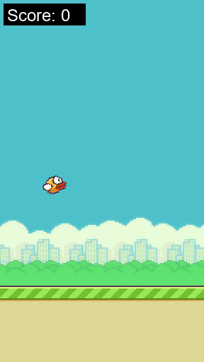
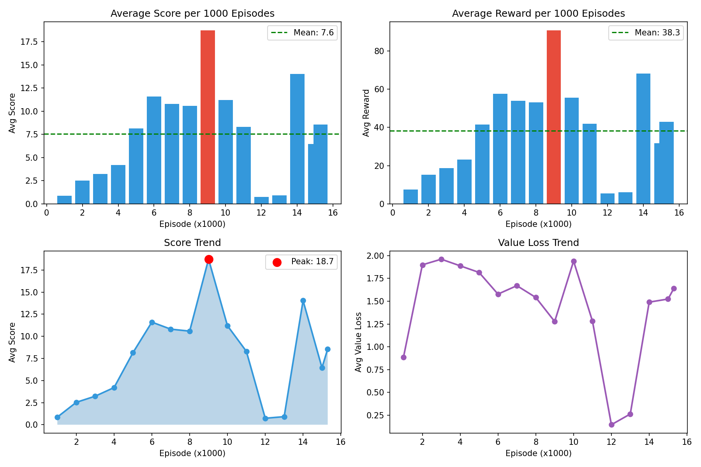

# Flappy Bird PPO — 강화학습 에이전트 학습
> PPO(Proximal Policy Optimization) 알고리즘을 PyTorch로 직접 구현해 Flappy Bird 환경에서 5,000,000 스텝 학습시킨 강화학습 프로젝트입니다.




---

## 📌 At a Glance

| 항목 | 내용 |
|------|------|
| **기간** | 2025.11 ~ 2025.12 (약 1개월, 강화학습 수업 과제) |
| **팀** | 1인 개발 |
| **본인 역할** | 알고리즘 구현 / 하이퍼파라미터 튜닝 / 학습 분석 단독 수행 |
| **스택** | Python 3.10 · PyTorch (CUDA) · Gymnasium |
| **알고리즘** | PPO + GAE + Actor-Critic |
| **결과** | 최고 Reward **1,400** / 한 에피소드 파이프 **300+** 통과 |

---

## ✨ Highlights

- **PPO Clipped Surrogate Objective** PyTorch 처음부터 구현
- **GAE (Generalized Advantage Estimation)** 로 편향-분산 trade-off 제어
- **Entropy bonus** 로 후반에도 탐색 유지하며 plateau 회피
- **5,000,000 스텝 / 16,000+ 에피소드** 학습으로 평균 reward 곡선 안정적 상승
- 강화학습 수업 PDF 보고서 작성 (`RL_FlappyBird_Project_V2025114박준형.pdf`)

---

## 📈 Results



| 항목 | 결과 |
|------|------|
| 총 학습 스텝 | 5,000,000 |
| 총 에피소드 | 16,000+ |
| 최고 Reward | **1,400** |
| 최고 Score (파이프 통과) | **300+** |

### 학습 단계별 변화

| 스텝 구간 | 행동 | Reward |
|-----------|------|--------|
| 0 ~ 500K | 무작위 행동 | ~0 |
| 500K ~ 1.5M | 파이프 1~5개 통과 | 50 ~ 200 |
| 1.5M ~ 3M | 파이프 30~100개 | 500 ~ 900 |
| 3M ~ 5M | 안정적으로 100+ 통과 | 최고 **1,400** |

---

## 🛠 How It Works

### 1. PPO (Clipped Surrogate Objective)

핵심 아이디어: 정책 업데이트 시 새 정책이 이전 정책에서 너무 멀어지지 않도록 비율을 클리핑.

```
ratio       = π_new(a|s) / π_old(a|s)
L_clip      = E[min(ratio·A, clip(ratio, 1-ε, 1+ε)·A)]
L_total     = L_clip - c1·L_value + c2·L_entropy
```

### 2. Actor-Critic 네트워크

```python
class PPOAgent(nn.Module):
    def __init__(self, obs_dim, act_dim):
        super().__init__()
        # Actor: 상태 → 행동 확률 (Flap / No Flap)
        self.actor = nn.Sequential(
            nn.Linear(obs_dim, 128), nn.ReLU(),
            nn.Linear(128, 128),     nn.ReLU(),
            nn.Linear(128, act_dim),
        )
        # Critic: 상태 → 가치 추정
        self.critic = nn.Sequential(
            nn.Linear(obs_dim, 128), nn.ReLU(),
            nn.Linear(128, 128),     nn.ReLU(),
            nn.Linear(128, 1),
        )

    def update(self, batch):
        ratio  = torch.exp(new_log_probs - old_log_probs)
        surr1  = ratio * advantages
        surr2  = torch.clamp(ratio, 1 - CLIP_EPS, 1 + CLIP_EPS) * advantages

        actor_loss   = -torch.min(surr1, surr2).mean()
        critic_loss  = F.mse_loss(values, returns)
        entropy_loss = -dist.entropy().mean()

        loss = actor_loss + 0.5 * critic_loss + 0.01 * entropy_loss
        loss.backward()
        self.optimizer.step()
```

### 3. GAE (Generalized Advantage Estimation)

단순 TD(0)은 편향 큼, MC는 분산 큼 → λ로 trade-off 제어.

```python
def compute_gae(rewards, values, dones, gamma=0.99, lam=0.95):
    advantages = []
    gae, next_value = 0, 0
    for t in reversed(range(len(rewards))):
        if dones[t]:
            next_value, gae = 0, 0
        delta = rewards[t] + gamma * next_value - values[t]
        gae   = delta + gamma * lam * gae
        advantages.insert(0, gae)
        next_value = values[t]
    returns = [a + v for a, v in zip(advantages, values)]
    return advantages, returns
```

### 4. 관찰된 문제와 해결

| 문제 | 해결 |
|------|------|
| 초기 reward가 너무 sparse → 학습 진행 안 됨 | Reward shaping (살아있는 시간 비례 보상) 추가 |
| 일정 수준 도달 후 plateau | Entropy coefficient 미세 조정으로 탐색 유지 |

---

## ⚙️ Hyperparameters

| 파라미터 | 값 | 설명 |
|----------|-----|------|
| Learning Rate | 3e-4 | 학습률 |
| Gamma (γ) | 0.99 | 할인율 |
| GAE Lambda (λ) | 0.95 | GAE 파라미터 |
| PPO Clip (ε) | 0.2 | 정책 클리핑 범위 |
| PPO Epochs | 10 | 업데이트 반복 횟수 |
| Batch Size | 64 | 배치 크기 |
| N Steps (rollout) | 2048 | 롤아웃 스텝 |
| Entropy Coef | 0.01 | 탐색 유지 계수 |
| Value Coef | 0.5 | 가치 손실 가중치 |

---

## 🚀 Getting Started

### 환경 설치

```bash
pip install gymnasium flappy-bird-gymnasium torch matplotlib pandas
```

### 학습 실행

```bash
python train_flappy_bird.py
```

### 학습된 모델로 플레이

```bash
python train_flappy_bird.py play
# 또는
python play.py
```

### 학습 로그 시각화

```bash
python plot_log.py        # 상세 로그 그래프
python plot_summary.py    # 요약 그래프
```

---

## 📂 Project Structure

```
rl-flappy-bird-train/
├── config.py                              # 하이퍼파라미터 설정
├── agent.py                               # PPO 에이전트 (Actor-Critic)
├── train_flappy_bird.py                   # 학습 + 테스트 스크립트
├── play.py                                # 학습된 모델 플레이
├── plot_log.py                            # 학습 로그 상세 시각화
├── plot_summary.py                        # 학습 요약 시각화
├── ppo_flappy.pth                         # 학습된 모델 가중치
├── training_log.txt                       # 학습 로그 데이터
├── training_summary_plot.png             # 학습 결과 그래프
└── gameplay.gif                          # 학습된 에이전트 플레이 영상
```

---

## 🧠 Applied Patterns

| 패턴 | 사용처 |
|------|--------|
| Actor-Critic | 정책 네트워크와 가치 네트워크 분리, 각각 다른 손실로 학습 |
| Clipped Objective | PPO 핵심 — 정책 업데이트 비율을 ±ε로 제한 |
| GAE | γλ 가중치로 TD와 MC 사이의 편향-분산 trade-off 제어 |
| Rollout Buffer | N steps 만큼 경험 수집 후 미니배치로 K 에포크 업데이트 |

---

## 🧪 Lessons Learned

- 정책 기반 강화학습에서 안정성 확보가 얼마나 까다로운지 체감 — Clipped Surrogate Objective의 실효성 확인
- **Reward shaping의 중요성**: 보상이 sparse하면 학습 자체가 시작되지 않음
- Entropy bonus 비중에 따라 탐색-수렴의 균형이 크게 달라짐을 실험적으로 검증
- GAE λ 값(0.9 / 0.95 / 1.0)을 변경하며 학습 곡선 비교
- 강화학습은 하이퍼파라미터에 매우 민감 → 학습 로그 자동화가 필수

---

## 🔗 Links

- 📖 **Portfolio**: https://junhyeong7083.github.io/PortFolio/portfolio/rl-flappy
- 📄 [PPO 논문](https://arxiv.org/abs/1707.06347)
- 🌱 [flappy-bird-gymnasium](https://github.com/markub3327/flappy-bird-gymnasium)
